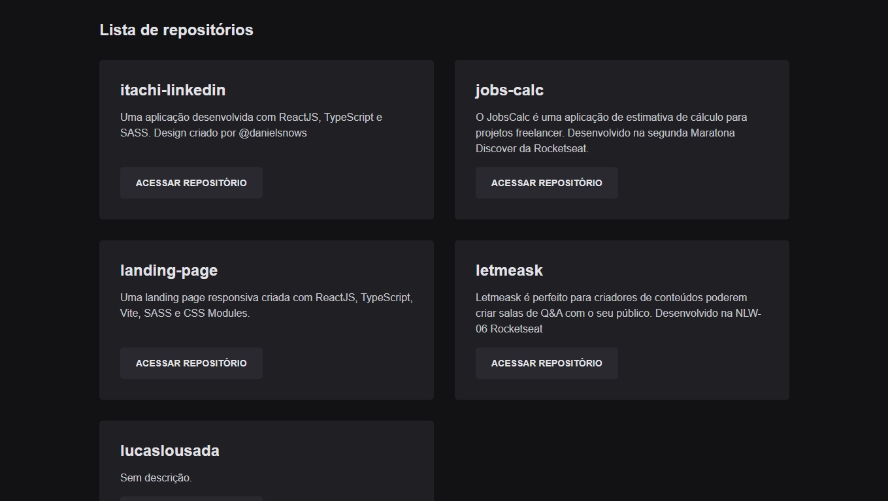

## 01 GitHub Explorer

Um projeto que lista todos os repositórios públicos do seu GitHub. Este é o primeiro projeto do curso Ignite da Rocketseat, que foca nos fundamentos do front-end dentro do ReactJS.

Foi ensinado como configurar a estrutura de um projeto ReactJS do zero, configurando webpack, babel, typescript e pré-processadores CSS sem ferramentas como create-react-app.

Também foram ensinados conceitos como: SPA, ambiente de desenvolvimento e de produção, componentização, useState, useEffect, imutabilidade, propriedades, typescript e consumo de uma API com a listagem dos dados recebidos em vários componentes.

