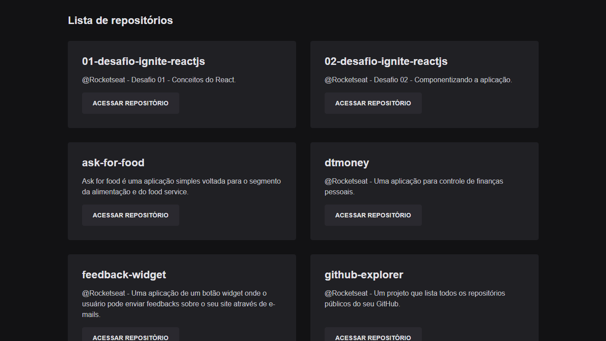

## GitHub Explorer

Um projeto que lista todos os repositórios públicos do seu GitHub.

Aplicação desenvolvida no primeiro capítulo do curso Ignite da Rocketseat, que foca nos fundamentos do front-end dentro do ReactJS.

[](https://github.com/lucaslousada)
[](#)
[](#)
[](#)
[](LICENSE.md)

<div>
  
</div>

## Tecnologias

Esse projeto foi desenvolvido com as seguintes tecnologias:

- ReactJS
- TypeScript
- SASS

## Executar o projeto

Você precisa instalar o [Git](https://git-scm.com/downloads) e o [Node.js](https://nodejs.org/en/download/) para executar este projeto.
Você pode usar [Yarn](https://yarnpkg.com/) ou [Npm](https://nodejs.org/en/download/).

```bash
# Clone o projeto e acesse a pasta
$ git clone https://github.com/lucaslousada/github-explorer.git && cd github-explorer
# Instale as dependências
$ yarn
# Inicie a aplicação
$ yarn dev
```

Aplicação: http://localhost:8080

## Licença

Este projeto está licenciado sob a Licença MIT - veja o arquivo [LICENSE](LICENSE.md) para mais detalhes.
